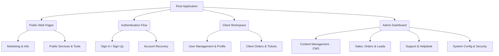

# System Architecture & Sitemap Specification
**INT Legal Management System**

This document provides a comprehensive overview of the application's page architecture, directory structure, and functional routing. It serves as a reference for developers, administrators, and project stakeholders.

---

## 1. Structural Overview

The application follows a role-based modular architecture, dividing the interface into three primary domains: Public Web, Client Portal (Workspace), and System Administration.

---

## 2. Directory & Route Mapping

The table below outlines the core application routes, their corresponding physical file structures, and brief functional notes regarding their purpose.

### 2.1 Public Interfaces
Accessible to all visitors. Focused on marketing, public relations, and initial client onboarding.

| Route / Path | File Structure (`src/routes/`) | Functional Notes |
|:---|:---|:---|
| `/` | `index.tsx` | Main landing page highlighting core values and services. |
| `/about` | `about.tsx` | Corporate background and organizational information. |
| `/contact` | `contact.tsx` | Public contact forms and geographical locations. |
| `/careers` | `careers.tsx` | Job board for prospective applicants. |
| `/industries` | `industries.tsx` | Industry-specific legal solutions overview. |
| `/partners` | `partners.tsx` | Affiliated entities and partnership programs. |
| `/projects` | `projects.tsx` | Showcase of notable legal cases or public projects. |
| `/services` | `services.tsx`, `services.$slug.tsx` | Dynamic legal service offerings and descriptions. |
| `/shop` | `shop.index.tsx`, `shop.$slug.tsx` | E-commerce front for legal products/templates. |
| `/cart` | `cart.tsx` | E-commerce shopping cart management. |
| `/news` | `news.index.tsx`, `news.$slug.tsx` | Blog and corporate announcements. |
| `/track-application`| `track-application.tsx` | Public tracking tool for submitted applications. |
| `/track-quote` | `track-quote.tsx` | Public tracking tool for requested service quotes. |

### 2.2 Authentication & Identity
Handles session management, credential validation, and user onboarding.

| Route / Path | File Structure (`src/routes/`) | Functional Notes |
|:---|:---|:---|
| `/signin` | `signin.tsx` | Secure user login gateway. |
| `/signup` | `signup.tsx` | New user registration workflow. |
| `/forgot-password`| `forgot-password.tsx` | Initiation of password reset process via email. |
| `/reset-password` | `reset-password.tsx` | Secure token validation and credential update. |

### 2.3 Client Workspace (`/dashboard/workspace`)
Secure environment for authenticated clients to manage their interactions with the firm.

| Route / Path | File Structure | Functional Notes |
|:---|:---|:---|
| `/` (Overview) | `dashboard.workspace.index.tsx`| Client dashboard summary and quick actions. |
| `/profile` | `dashboard.workspace.profile.tsx`| Client personal and organizational settings. |
| `/new` | `dashboard.workspace.new.tsx` | Creation wizard for new legal requests/workspaces. |
| `/assessment` | `dashboard.workspace.assessment.tsx`| Legal assessment forms and questionnaires. |
| `/orders` | `dashboard.workspace.orders...` | Order history, invoicing, and current statuses. |
| `/tickets` | `dashboard.workspace.tickets...` | Direct support channels and communication threads. |
| `/track` | `dashboard.workspace.track.tsx` | Detailed status tracking for active client matters. |

### 2.4 Administration System (`/dashboard/admin`)
Restricted backend system for staff and administrators to govern the platform.

#### 2.4.1 Content Management (CMS)
| Route / Path | File Structure | Functional Notes |
|:---|:---|:---|
| `/about`, `/careers`| `...admin.about.tsx`, `...careers.tsx` | Editors for corporate content and job listings. |
| `/news`, `/services`| `...admin.news.tsx`, `...services.tsx` | Publication controls for articles and service pages. |
| `/policies`, `/terms`| `...admin.policies.tsx`, `...terms.tsx` | Management of legal disclaimers and agreements. |
| `/faqs`, `/reviews` | `...admin.faqs.tsx`, `...reviews.tsx` | Curation of public knowledge base and testimonials. |

#### 2.4.2 Business Operations (Sales & Support)
| Route / Path | File Structure | Functional Notes |
|:---|:---|:---|
| `/orders`, `/products`| `...admin.orders.tsx`, `...products...` | Fulfillment tracking and digital inventory management. |
| `/leads`, `/quotations`| `...admin.leads...`, `...quotations...`| CRM pipeline, lead scoring, and automated quoting. |
| `/helpdesk` | `...admin.helpdesk...` | Unified inbox, SLA monitoring, and ticket routing. |
| `/chatbot` | `...admin.chatbot.tsx` | Configuration for automated client response logic. |

#### 2.4.3 System & Security Configuration
| Route / Path | File Structure | Functional Notes |
|:---|:---|:---|
| `/users`, `/clients`| `...admin.users...`, `...clients...` | Identity management, RBAC, and client provisioning. |
| `/permissions` | `...admin.permissions.tsx` | Granular role and access control definitions. |
| `/settings`, `/security`| `...admin.settings.tsx`, `...security.tsx`| Global application parameters and audit logs. |
| `/seo`, `/smtp` | `...admin.seo.tsx`, `...smtp.tsx` | Marketing metadata config and mail server bridging. |
| `/reports` | `...admin.reports.tsx` | System-wide analytics and performance exports. |

---

## 3. Implementation Notes

- **Dynamic Routing:** Routes utilizing `$slug` or `$id` in their filenames rely on dynamic parameters to render content dynamically (e.g., specific database records).
- **Access Control:** All paths prefixed with `/dashboard` utilize robust middleware to ensure authentication. The `/dashboard/admin` sub-tree strictly requires elevated administrative privileges.
- **Component Architecture:** To maintain standard practices, shared UI elements across these routes should be extracted into `src/components`, rather than housed in the `src/routes` directory.
